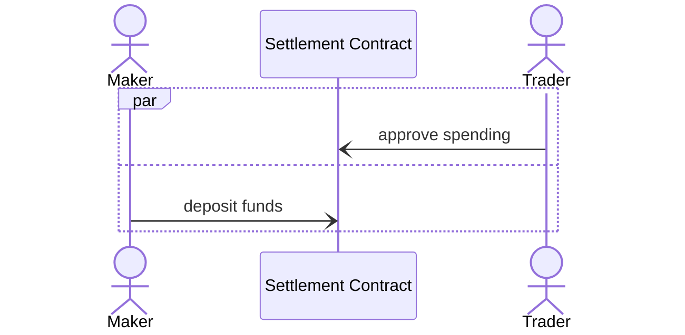

# Onboarding of the system actors

## Actors
- Maker
- Trader

## Simple onboarding flow (without using borrowed capital)

```mermaid
sequenceDiagram
    actor maker as Maker
    participant contract as Settlement Contract
    actor trader as Trader
    par
        trader -) contract: approve spending
    and 
        maker -) contract: deposit funds
    end
```
