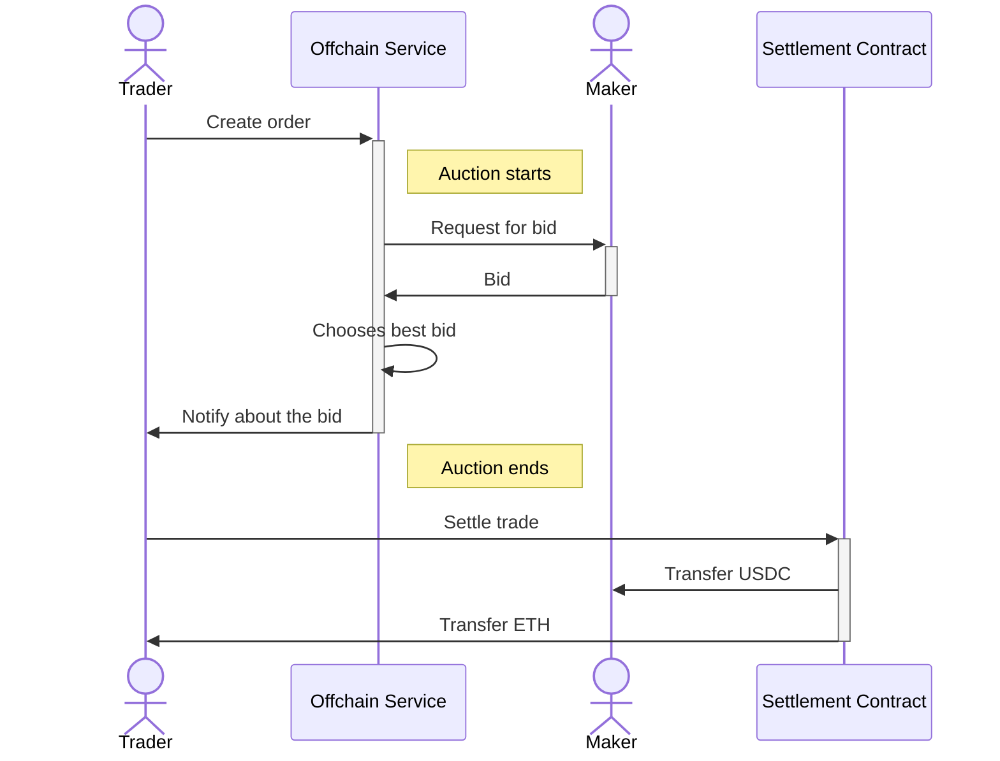

# Trade interactions

## Actors
- Maker
- Trader
- // TBD: Lender

## Simple trading flow (without using borrowed capital)

```mermaid
sequenceDiagram
    actor trader as Trader
    participant service as Offchain Service
    actor maker as Maker
    participant contract as Settlement Contract
    trader ->>+ service: Create order
    Note right of service: Auction starts
    service ->>+ maker: Request for bid
    maker ->>- service: Bid
    service ->> service: Chooses best bid
    service ->>- trader: Notify about the bid
    Note right of service: Auction ends
    trader ->>+ contract: Settle trade
    contract ->> maker: Transfer USDC
    contract ->>- trader: Transfer ETH
```
