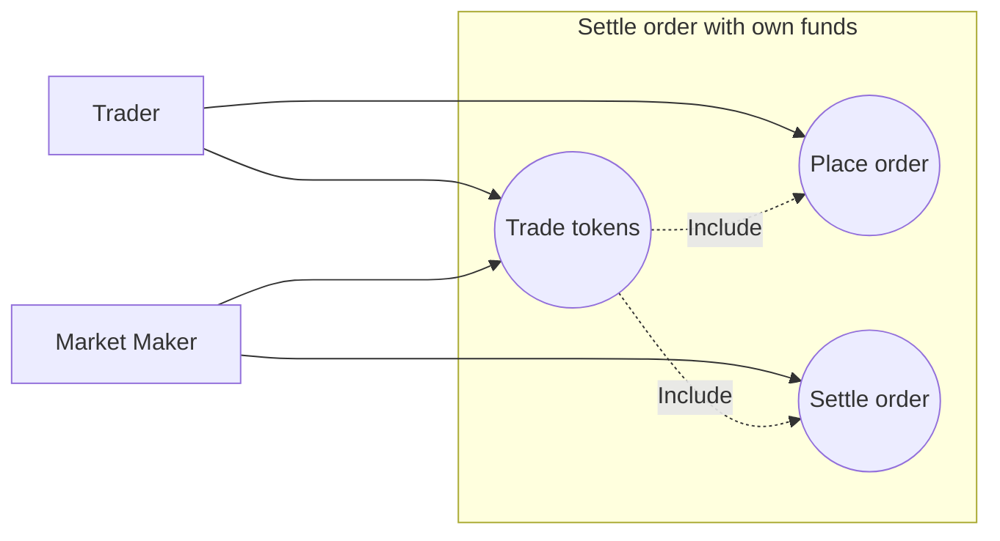

# Market maker settles order with his own funds

## Actors
- Trader
- Market Maker

## Description
Use case explains how market maker can settle orders with their own funds.

## Preconditions
- Market maker has enough amount of token user wants to buy.
- 1 ETH = 1000 USDC

| Token / Balance | Market Maker | Trader |
|-----------------|:------------:|:------:|
| ETH             |      1       |   0    |
| USDC            |      0       |  1000  |

## Trigger
User places an order to buy ETH.

## Main flow
- User posts an order to buy tokens (e.g. ETH for USDC)
- System notifies market makers about the order
- Makers competing in an auction, the best quote wins
- Maker settles the order with their own funds

## Alternative flows
### Market maker partially fills order 
In this case we need a extra makers to fill the rest of the order.

### Order is canceled
Auction stops

## Postconditions
| Token / Balance | Market Maker |   Trader   | System |
|-----------------|:------------:|:----------:|:------:|
| ETH             |      0       | 1 - fees % | fees % |
| USDC            |     1000     |     0      |   0    |

## Exceptions

### No makers matched the order
Order times out

## Use case diagram

