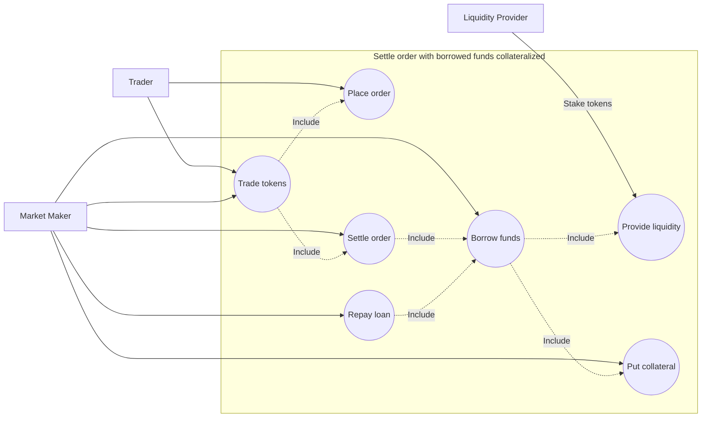

# Market maker settles order with borrowed capital (collateralized)

## Actors
- Trader
- Market Maker
- Liquidity Provider

## Description
Use case explains how market maker can settle orders with borrowed capital. 
Borrow is fully collateralized.

## Preconditions
- Liquidity provider has enough funds to lend
- Market maker has enough collateral to borrow
- 1 ETH = 1000 USDC

| Token / Balance | Market Maker | Trader | Liquidity Provider |
|-----------------|:------------:|:------:|:------------------:|
| ETH             |      0       |   0    |         1          |
| USDC            |      0       |  1000  |         0          |
| USDT            |  1000 (LP)   |   0    |         0          |

## Trigger
User places an order to buy ETH.

## Main flow
- Trader posts an order to buy tokens (e.g. ETH for USDC)
- Maker wins auction
- Maker borrows 1 ETH from lending pool
- Maker sends 1 ETH to the trader
- Trader sends 1000 USDC to the maker
- Maker repays 1 ETH to the lending pool

## Alternative flows
### Market maker partially fills order 
In this case we need a extra makers to fill the rest of the order.

### Order is canceled
Auction stops

### Market maker gets liquidated
Example state wih 50% being liquidated

| Token / Balance | Market Maker |   Trader   | Liquidity Provider | Liquidator | System |
|-----------------|:------------:|:----------:|:------------------:|:----------:|:------:|
| ETH             |      0       | 1 - fees % |     1 + fees %     |     0      | fees % |
| USDC            |     1000     |     0      |         0          |     0      |   0    |
| USDT            |   500 (LP)   |     0      |         0          |    500     |   0    |

## Postconditions
// TODO: post state has extra 1 ETH on the trader's balance. 
Should we make state balanced with pre-conditions?

| Token / Balance | Market Maker |   Trader   | Liquidity Provider | System |
|-----------------|:------------:|:----------:|:------------------:|:------:|
| ETH             |      0       | 1 - fees % |     1 + fees %     | fees % |
| USDC            |     1000     |     0      |         0          |   0    |
| USDT            |  1000 (LP)   |     0      |         0          |   0    |

## Exceptions

### No makers matched the order
Order times out

## Use case diagram

