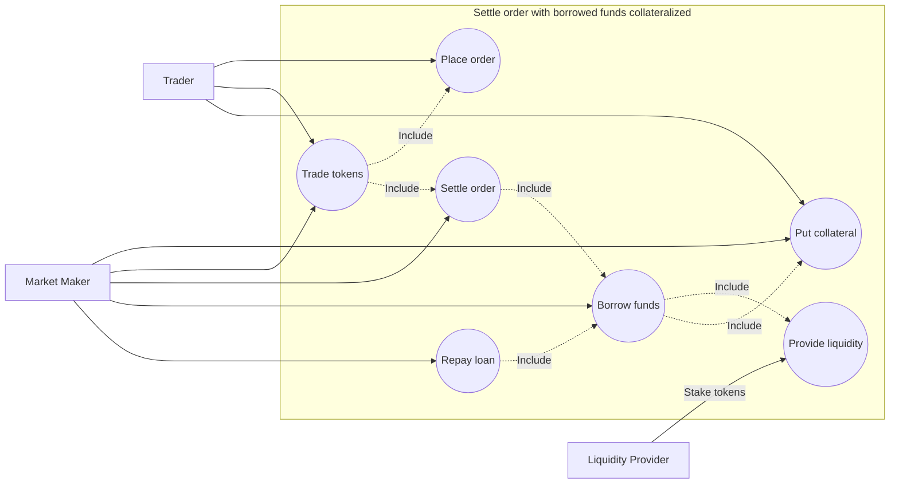

# Market maker settles order with borrowed capital (undercollateralized)

## Actors
- Trader
- Market Maker
- Liquidity Provider

## Description
Use case explains how market maker can settle orders with borrowed capital.
Borrow is undercollateralized.

## Preconditions
- Liquidity provider has enough funds to lend
- Market maker has enough collateral to initiate borrow with shared collateral
- 1 ETH = 1000 USDC

| Token / Balance | Market Maker | Trader | Liquidity Provider |
|-----------------|:------------:|:------:|:------------------:|
| ETH             |      0       |   0    |         1          |
| USDC            |      0       |  1000  |         0          |
| USDT            |   300 (LP)   |   0    |         0          |

## Trigger
User places an order to buy ETH.

## Main flow
- Trader posts an order to buy tokens (e.g. ETH for USDC)
- Maker wins auction
- Maker initiates borrow with joined collateral depositing his part (300 USDC)
- Trader deposits remaining part of the joined collateral (1000 USDC)
- Maker borrows 1 ETH and sends it to the trader (In fact, borrow goes directly to the trader?)
- Maker repays 1 ETH to the lending pool unlocking 1300 USDC

## Alternative flows
### Market maker partially fills order
In this case we need a extra makers to fill the rest of the order.

### Order is canceled
Auction stops

### Market maker gets liquidated
Example state wih 50% being liquidated

// TBD

## Postconditions
// TODO: post state has extra 1 ETH on the trader's balance.
Should we make state balanced with pre-conditions?

| Token / Balance | Market Maker |   Trader   | Liquidity Provider | System |
|-----------------|:------------:|:----------:|:------------------:|:------:|
| ETH             |      0       | 1 - fees % |     1 + fees %     | fees % |
| USDC            |     1000     |     0      |         0          |   0    |
| USDT            |   300 (LP)   |     0      |         0          |   0    |

## Exceptions

### No makers matched the order
Order times out

## Use case diagram

